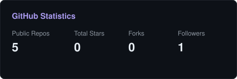

<!-- BANNER - Terminal HUD (Dynamic Dark / Light Mode with Cycling Animations: Portrait -> DevOps Cycle -> AWS Cloud) -->
<picture>
  <source media="(prefers-color-scheme: dark)"  srcset="assets/banner-dark.svg">
  <source media="(prefers-color-scheme: light)" srcset="assets/banner-light.svg">
  
</picture>

 

<!-- NAME / TAGLINE - Animated Typing -->

 

<!-- SOCIAL BADGES — Curated with #0d1117 base and #aa9bef accent -->
&nbsp;&nbsp;
&nbsp;&nbsp;
&nbsp;&nbsp;

 

<!-- PROFILE VIEW COUNTER -->

---

## ⚡ This is me :)

Hi, I'm **Sudarshan Chand**, a **DevOps Engineer &amp; Cloud Specialist** broadcasting from India 🇮🇳.  
I build resilient cloud architectures, automate deployment pipelines, and ensure infrastructure scales effortlessly with zero downtime.

- ☁️ **DevOps &amp; Cloud Focus**: Architecting highly available infrastructure on **AWS** with **Terraform**, **Docker**, and **Kubernetes**.
- 🚀 **CI/CD Automation**: Building automated end-to-end deployment pipelines using **Jenkins** and **GitHub Actions**.
- 📊 **Observability &amp; SRE**: Designing real-time telemetry, dashboards, and alerting systems using **Prometheus** and **Grafana**.
- 🐍 **Automation &amp; Scripting**: Automating operational workflows and cloud resources with **Python**, **Bash**, and **Node.js**.
- 🌱 **My Mission**: Helping engineering teams ship faster, safer, and with complete operational confidence.
- 💬 **Let's Talk**: Reach out about **DevOps culture, Kubernetes orchestration, cloud migration, or open-source infrastructure**!

 

---

## 🛠️ My Tech Stack

<table>
  <tr>
    <th align="left" width="260">Category Area</th>
    <th align="left">Technologies &amp; Tools</th>
  </tr>
  <tr>
    <td><b>☁️ Cloud &amp; Infrastructure</b></td>
    <td>
      
    </td>
  </tr>
  <tr>
    <td><b>🚀 CI/CD &amp; Version Control</b></td>
    <td>
      
    </td>
  </tr>
  <tr>
    <td><b>📈 Monitoring &amp; Observability</b></td>
    <td>
      
    </td>
  </tr>
  <tr>
    <td><b>💻 Programming &amp; Backend</b></td>
    <td>
      
    </td>
  </tr>
  <tr>
    <td><b>🎨 Frontend &amp; Web</b></td>
    <td>
      
    </td>
  </tr>
  <tr>
    <td><b>🗄️ Databases</b></td>
    <td>
      
    </td>
  </tr>
  <tr>
    <td><b>🛠️ Developer Tools &amp; IDEs</b></td>
    <td>
      &nbsp;
    </td>
  </tr>
</table>

---

## 📡 Signals

<table>
<tr>
<td width="50%" align="center" valign="middle">

<!-- DevOps Competencies Radar - edit assets/skills.json to update -->
<picture>
  <source media="(prefers-color-scheme: dark)"  srcset="assets/radar-dark.svg">
  <source media="(prefers-color-scheme: light)" srcset="assets/radar-light.svg">
  
</picture>

</td>
<td width="50%" align="center" valign="middle">

<!-- Language & IaC Stack Radar - edit assets/langmix.json to update -->
<picture>
  <source media="(prefers-color-scheme: dark)"  srcset="assets/radar-langs-dark.svg">
  <source media="(prefers-color-scheme: light)" srcset="assets/radar-langs-light.svg">
  
</picture>

</td>
</tr>
</table>

---

## 📊 Numbers matter? ohhh yes.

<!-- Self-hosted stat cards - Generated by scripts/cards.py into this repo.
     Deliberately avoids third-party services that suffer from 503 / 402 outages. -->
<picture>
  <source media="(prefers-color-scheme: dark)"  srcset="assets/card-stats-dark.svg">
  <source media="(prefers-color-scheme: light)" srcset="assets/card-stats-light.svg">
  
</picture>

 

<!-- Language breakdown SVG - refreshed automatically by .github/workflows/metrics.yml -->

---

` Built with precision &amp; curiosity · @SUDARSHNACHAND `

